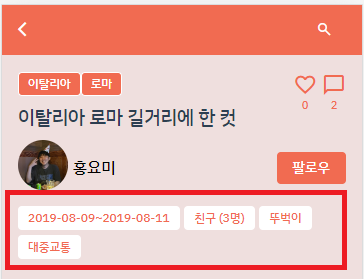
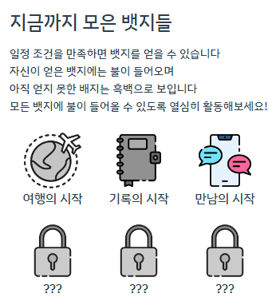

[TOC]


# 🤸 Trippy

> 여행에 특화된 **여행 코스 공유 SNS, Trippy**!
> 나의 여행을 내 여행 코스 순서대로 사진과 함께 기록할 수 있는 SNS 서비스입니다. 기록과 공유를 중심으로, 다양한 사람들과 함께 할 수 있는 기회를 동행 찾기 서비스를 통해 제공하고 있습니다.
>
> 참고: 모바일 전용 웹이므로 **모바일**에서 가장 최적화된 상태로 이용가능합니다

### 🔸Trippy 바로가기: https://i7a506.p.ssafy.io/

### 🔸UCC 영상 바로가기: https://youtu.be/udKdfa8RtG4


# 🧡 제작 배경 & 주요 기능 소개

### 🔸제작 배경

COVID 19로 억눌렸던 여행욕구, 이제는 분출할 때! 오랜 기간 여행을 쉬었더니 여행, 어디로 가야할지 어떻게 준비해야할지 막막하시죠? 

Trippy를 통해 다른 사람들이 어떤 곳을 어떻게 다녀왔는지 알아보세요! 

Trippy는 타 SNS와는 달리 다른 사람이 일정 지역을 여행다닌 코스를 한 눈에 지도에서 볼 수 있어 일정 파악이 용이하고, 누구와 어떤 이동수단을 언제 갔는지를 쉽게 파악할 수 있어요.


### 🔸주요 기능

#### 다이어리

* Trippy의 핵심 기능이라고 할 수 있는 다이어리입니다. 

* 다이어리에는 trippy 이용자들이 다녀온 여행지에 대한 정보가 담겨있는데, 해당 정보는 아래와 같습니다.

  

  * 여행 일정 
  * 누구와 다녀왔는지, 몇 명과 함께 갔는지
  * 이동수단이 무엇인지

* 여행지에서의 경로를 한 눈에 볼 수 있는 지도(해외도 가능🌏!)

  

* 그리고 여행 경로마다 자신만의 사진과 글을 기록하여 자신만의 여행 코스를 손쉽게 공유할 수 있습니다

  

  

#### 동행찾기

* 여행을 다니다보면 혼자서는, 혹은 둘이서는 할 수 없는 일들이 많은 것을 느끼셨을거예요

* Trippy의 동행찾기 기능을 이용한다면, 비슷한 장소에 위치한 사람들끼리의 모임이 쉬워집니다!

  

#### 게이미피케이션

* Trippy 안에서의 활발하게 활동한다면, 귀여운 뱃지도 가질 수 있어요! 




# 🧡 산출물

* [와이어프레임&스토리보드](https://www.figma.com/file/C4MfolSqITjGiE1KPomrWQ/TRIPPY?node-id=0%3A1)
* [ERD](https://www.erdcloud.com/d/22AbgKH3sYpS7jBBA) 
* [API: Swagger](https://github.com/hotsix-turtles/TUPLI/blob/dev/docs/API.md)
* [컴포넌트구조도](https://app.diagrams.net/#G1oONA1JfoRr81LHM7TBCpef-x8Y00cLUI)
* [시퀀스 다이어그램](https://app.diagrams.net/#G1L46-cLTsR_ATDxsFkVIE9gHPdRXvaWOI)

* [컨벤션](https://www.notion.so/2f3624969a2b48df84561bafe393ecf8)
* [디자인](https://second-joke-d45.notion.site/35ac83e8736b40dcb712cfb02feb50fe?v=a92e51533bfc4113852342dd78be3232) 


# 🧡 협업

### 🔸무송합니다 팀을 소개합니다!

* PPT 끝나면 거기서 가져올 예정


### 🔸협업 툴

- Gitlab
- Jira
- [Notion](https://second-joke-d45.notion.site/TRIPPY-a183e6390df6452cbe07e5d137987aab)
- Mattermost
- Webex


# 🛠️ Tech Stack

### 🔸backend

* IntelliJ IDE
* Springboot 2.7.2
* Spring Data JPA
* Spring Security
* MySQL
* Redis
* QueryDSL
* Swagger 3.0.0


### 🔸frontend

* Visual Studio Code IDE
* Vue 3.2.37
* Vuex 4.0.2
* Element Plus (UI Framework)


### 🔸CI/CD

* Docker
* AWS EC2
* Jenkins
* NGINX
* SSL


# ⚙️ Installation & Deployment


## 🔸Ubuntu 기본 설치

```
sudo apt-get install nodejs
sudo apt-get install npm
```


## 🔸docker 설치

```
# 필수 패키지 설치
sudo apt-get install apt-transport-https ca-certificates curl gnupg-agent software-properties-common
# GPG Key 인증
curl -fsSL https://download.docker.com/linux/ubuntu/gpg | sudo apt-key add -
# docker repository 등록
sudo add-apt-repository "deb [arch=amd64] https://download.docker.com/linux/ubuntu $(lsb_release -cs) stable"
# 도커 설치
sudo apt-get update && sudo apt-get install docker-ce docker-ce-cli containerd.io
# 시스템 부팅시 도커 시작
sudo systemctl enable docker && service docker start
# 도커 확인
sudo service docker status
```


## 🔸certbot 설치

### Ubuntu 16.04 (LTS), Ubuntu 18.04 (LTS) 저장소 세팅

저장소 설정 및 업데이트 진행

```bash
sudo apt-get update
sudo add-apt-repository universe
sudo add-apt-repository ppa:certbot/certbot
sudo apt-get update
```

### Ubuntu 20.04 (LTS) 저장소 세팅

저장소를 설정 및 업데이트 진행

```bash
sudo apt-get update
sudo apt-get install software-properties-common
sudo add-apt-repository universe
sudo apt-get update
```

### 공통

기존에 설치된 Certbot 패키지가 있다면 삭제합니다.

$ sudo apt remove certbot

certbot 설치

```bash
sudo apt-get install certbot python3-certbot-nginx
```


## 🔸Nginx 세팅

Certbot이 자동으로 SSL을 세팅해주기 때문에 `server block`과 `server_name`을 설정해주면 됩니다.

```bash
sudo vim /etc/nginx/sites-available/[your server block]
```

아래는 제 예시입니다. `undang_backend_nginx.conf`에 블록들이 있기 때문에 아래처럼 되었습니다.

```
$ sudo vim /etc/nginx/sites-available/undang_backend_nginx.conf
```

이제 서버 블록 파일 안에 server_name을 설정하고자 하는 도메인 이름으로 변경해주시면 됩니다. 저는 아래와 같습니다.

````
...

# configuration of the server

server {

```
# Put your domain next to server_name
server_name undang.twpower.me;
charset     utf-8;

# max upload size
client_max_body_size 75M;   # adjust to taste
```

...

}
````

설정이 완료 되었다면 저장하고 아래 명령어를 통해서 재시작합니다.

```bash
$ sudo nginx -t
$ sudo service nginx reload
```


## 🔸SSL 인증 획득하기

다음 아래 명령어를 사용하면 nginx plugin을 통해서 가능합니다. 도메인을 추가적으로 더 하고 싶다면(위에 server_name에도 물론 설정이 되어있어야겠죠?) `-d` 옵션을 주고 더 주가하면 됩니다.

```bash
sudo certbot --nginx -d example.com -d www.example.com
```

제 예시는 아래와 같습니다.

```bash
sudo certbot --nginx -d i7a506.p.ssafy.io
```

그러면 아래와 같이 1과 2를 선택하는 화면이 나오는데 저와 같은 경우는 모든 경우를 https로 하고 싶어서 redirect를 허용하는 2번을 하였습니다.

```
## Please choose whether or not to redirect HTTP traffic to HTTPS, removing HTTP access.
-------------------------------------------------------------------------------
## 1: No redirect - Make no further changes to the webserver configuration. 2: Redirect - Make all requests redirect to secure HTTPS access. Choose this for new sites, or if you're confident your site works on HTTPS. You can undo this change by editing your web server's configuration.
-------------------------------------------------------------------------------
Select the appropriate number [1-2] then [enter] (press 'c' to cancel): 2
```


번호를 선택해주면 아래처럼 진행되며 key들도 자동으로 생성해줍니다.


## 🔸인증서 자동갱신 설정 확인

설정한 `certbot`은 90일 동안만 유효하기 때문에 갱신을 해줘야합니다. 매번 해주기 귀찮으나 설치한 `certbot`은 자동으로 갱신을 이틀 단위로 해줍니다.

해당하는 갱신이 제대로 되는지는 아래 명령어를 통해서 확인 가능하며 에러가 나타나지 않으면 renewal이 정상적으로 작동 할겁니다.

```bash
sudo certbot renew --dry-run
```

Ubuntu의 경우 `/etc/cron.d/`에 보면 `certbot`이 생성되어있습니다.


## 🔸 SSL 적용 확인 및 평가

본인의 서버에 SSL이 적용이 잘 되었는지 평가할 수 있는 여러 사이트가 있는데 들어가서 본인의 서버 도메인을 입력하면 됩니다.

https://www.ssllabs.com/ssltest/


## 🔸Docker 초기화

실행 중인 도커 중, 이름이나 포트가 겹칠 위험이 있기 때문에 중지를 시킵니다.

```
# 도커 시작 전, 기존에 실행중인 도커를 멈추고 제거하는 작업.
docker ps -f name=frontend -q | xargs --no-run-if-empty docker container stop
docker ps -f name=backend -q | xargs --no-run-if-empty docker container stop

# 컨테이너 제거
docker container ls -a -f name=frontend -q | xargs -r docker container rm
docker container ls -a -f name=backend -q | xargs -r docker container rm'

# 도커 이미지 제거
docker images -f dangling=true && docker rmi $(docker images -f dangling=true -q)
```


## 🔸frontend Dockerfile 이미지 생성 및 빌드 실행

```
docker build -t ygpark96/frontend .
docker run -d -p 8081:80 --name frontend ygpark96/frontend
```

- 여기서 **/etc/letsencrypt/live/도메인이름/** 경로는 SSL 인증 키가 있는 위치입니다. vue.js 빌드와 nginx가 시작됩니다.


## 🔸backend Dockerfile 이미지 생성 및 빌드 실행

```
docker build -t ygpark96/backend .
docker run -d -p 8080:8080 --name backend ygpark96/backend
```

- springboot Gradle Multi Module을 시작합니다.


